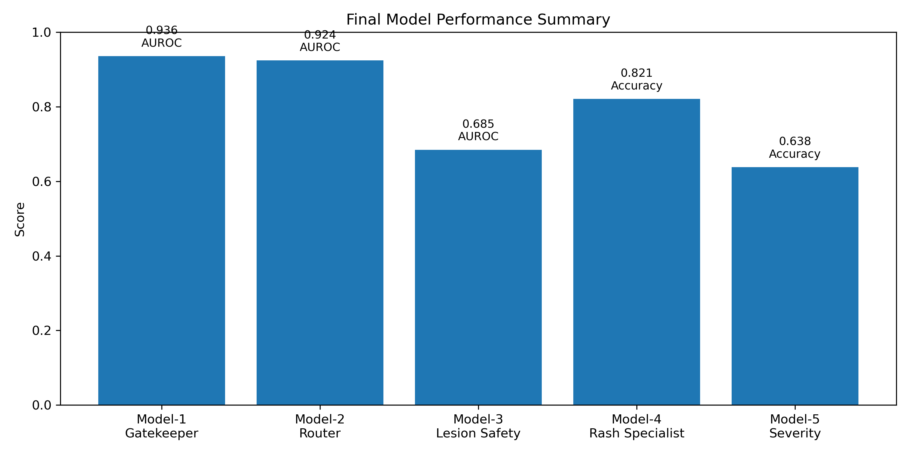
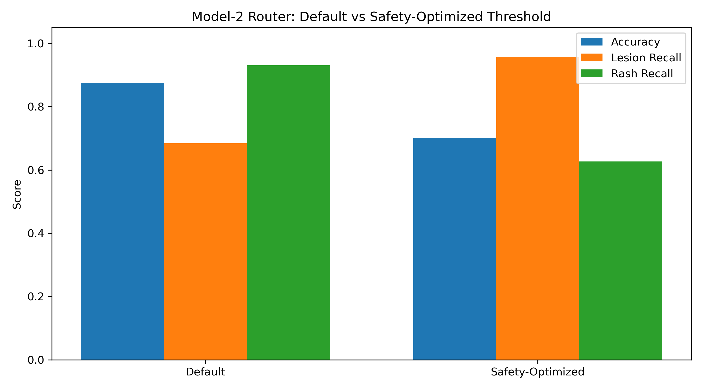
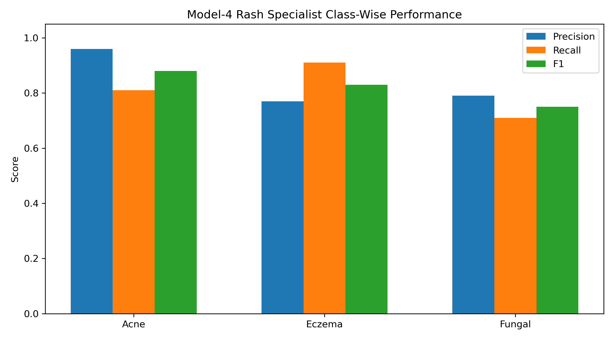
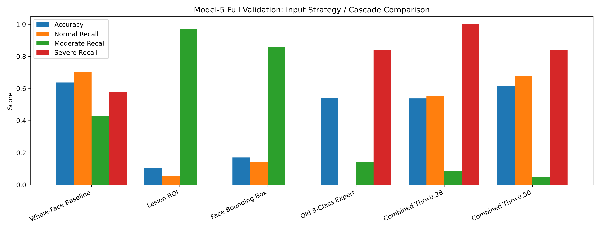

# Safety-Oriented Edge Dermatology Guidance System  
**Hierarchical MobileNetV3 Pipeline for Skin Guidance, Lesion Safety Screening, Rash Classification, and Acne Severity Estimation**

This repository contains a lightweight **edge-deployable dermatology guidance pipeline** developed as a staged computer vision system for common skin conditions and safety-oriented lesion triage.

The system uses a **hierarchical model architecture** instead of one large multi-class classifier. This makes the pipeline easier to control, easier to debug, and more suitable for safety-first thresholding.

---

# Key Figures

## Pipeline Architecture


## Model Performance Summary


## Router Threshold Comparison


## Rash Specialist Class-Wise Performance


## Acne Severity Ablation Study


---

# Pipeline Overview

The final system contains five stages:

1. **Model-1: Gatekeeper**
   - Normal / non-skin vs abnormal skin filtering

2. **Model-2: Router**
   - Lesion vs rash routing

3. **Model-3: Lesion Safety Net**
   - Lower-risk vs suspicious lesion screening

4. **Model-4: Rash Specialist**
   - Acne vs eczema vs fungal classification

5. **Model-5: Acne Severity**
   - Normal / mild / moderate / severe acne estimation
   - Includes a separate severe-alert threshold

The decision flow is:

```text
Input Image
   ↓
Model-1 Gatekeeper
   ↓
Model-2 Router
   ├── Lesion Branch → Model-3 Lesion Safety
   └── Rash Branch   → Model-4 Rash Specialist
                          ↓
                      Model-5 Acne Severity
```

---

# Repository Structure

```text
├── assets/
│   └── pipeline_architecture.png
├── configs/
│   ├── acne5_severe_alert_threshold.example.json
│   ├── gatekeeper_threshold.example.json
│   ├── lesion_safety_config.example.json
│   └── pipeline_cfg.example.json
├── notebooks/
│   ├── 01_gatekeeper_training.ipynb
│   ├── 02_router_training.ipynb
│   ├── 03_lesion_safety_training.ipynb
│   ├── 04_rash_specialist_training.ipynb
│   ├── 05_acne_severity_experiments.ipynb
│   └── 06_final_inference_pipeline.ipynb
├── results/
│   ├── confusion_matrices/
│   ├── figures/
│   └── tables/
├── src/
│   └── inference_controller.py
├── README.md
├── requirements.txt
├── .gitignore
└── LICENSE
```

---

# Datasets Used

The project uses public dermatology datasets:

- **Fitzpatrick17k**
- **DermNet**
- **PAD-UFES-20**
- **ACNE04**

These datasets were used for skin-condition diversity, lesion/rash routing, lesion safety screening, and acne severity grading.

---

# Data Availability

Raw datasets and trained model checkpoints are **not included** in this repository due to size and licensing constraints.

Excluded files include:

```text
data/
ACNE04/
DermNet/
PAD-UFES/
Fitzpatrick17k/
ISIC-images/
*.keras
*.tflite
*.h5
*.pt
```

This repository includes only:

- training notebooks
- inference code
- configuration templates
- evaluation tables
- figures
- confusion matrices
- documentation

Users should download the original public datasets from their official sources before reproducing the full pipeline.

---

# Model Summary

| Model | Task | Output |
|---|---|---|
| Model-1 | Gatekeeper | Normal/non-skin vs abnormal skin |
| Model-2 | Router | Lesion branch vs rash branch |
| Model-3 | Lesion safety | Lower-risk vs suspicious lesion |
| Model-4 | Rash specialist | Acne / eczema / fungal |
| Model-5 | Acne severity | Normal / mild / moderate / severe |

---

# Key Results

## Model-1: Gatekeeper

- AUROC: **0.9357**
- Threshold: **0.23**
- Sensitivity: **95.0%**
- Specificity: **77.2%**
- Accuracy: **82.6%**

---

## Model-2: Lesion/Rash Router

| Operating Point | Threshold | Accuracy | AUROC | Lesion Recall | Rash Recall |
|---|---:|---:|---:|---:|---:|
| Default | 0.50 | 87.6% | 0.925 | 68.4% | 93.1% |
| Safety-Optimized | 0.90 | 70.1% | 0.925 | 95.7% | 62.7% |

The safety-optimized threshold was selected to reduce missed lesion cases.

---

## Model-3: Lesion Safety Net

At threshold **τ = 0.3438**:

- AUROC: **0.6847**
- Accuracy: **82.2%**
- Sensitivity: **99.2%**
- Specificity: **17.7%**
- Precision: **82.1%**
- F1-score: **89.8%**

This model is intentionally conservative and prioritizes sensitivity over specificity.

---

## Model-4: Rash Specialist

Overall accuracy: **82.1%**

| Class | Precision | Recall | F1-score |
|---|---:|---:|---:|
| Acne | 0.96 | 0.81 | 0.88 |
| Eczema | 0.77 | 0.91 | 0.83 |
| Fungal | 0.79 | 0.71 | 0.75 |

---

## Model-5: Acne Severity

Model-5 predicts:

```text
normal / mild / moderate / severe
```

Severity grading was the most difficult part of the system due to:

- small class sizes
- visual similarity between moderate and severe acne
- source/domain bias

A separate severe-alert threshold was used:

```text
p(severe) ≥ 0.265
```

This alert is used as a secondary safety signal rather than replacing the top-1 severity prediction.

---

# Acne Severity Experiments

Several Model-5 variants were tested:

| Variant | Accuracy | Macro-F1 | Severe Precision | Mild Recall |
|---|---:|---:|---:|---:|
| ACNE04 only | 63.8% | 0.64 | 81% | 80% |
| ACNE04 + CelebA normals | 75.1% | 0.49 | 50% | 59% |
| ACNE04 + SCIN normals | 69.3% | 0.44 | 0% | 92% |

The high accuracy in the CelebA-normal version likely reflects source bias. SCIN normals reduced some source mismatch but degraded severe-case detection.

---

# Segmentation / ROI Experiments

Unsupervised segmentation was explored for acne severity using:

- marker-controlled watershed
- mean-shift style smoothing
- Lab a* redness maps
- facial landmark constraints
- ROI cropping

However, ROI-based severity inference caused distribution shift when the severity classifier had been trained on full-face images.

Full validation results showed that aggressive ROI cropping reduced overall performance and caused class bias. This supported the conclusion that any cropping strategy must be applied consistently during both training and inference.

---

# Inference Pipeline

The final inference pipeline is available in:

```text
notebooks/06_final_inference_pipeline.ipynb
```

and can be converted into script form using:

```text
src/inference_controller.py
```

Expected model files for local inference are:

```text
gatekeeper_float32.tflite
router_mnv3_router_v1_thr090.keras
lesion_safety_bal_focal_best.keras
rash_mnv3_stage2.keras
acne5_severity_stage3.keras
```

These trained models are not included in the repository.

Example usage:

```python
res = run_skin_pipeline("example_image.jpg")
print_pipeline_result(res)
```

The output includes:

- gatekeeper score
- router score
- lesion/rash branch decision
- rash class probabilities
- acne severity probabilities
- final guidance text

---

# Installation

Install dependencies:

```bash
pip install -r requirements.txt
```

Main dependencies:

```text
tensorflow
numpy
pandas
scikit-learn
matplotlib
pillow
opencv-python
tqdm
```

---

# Running the Project

Recommended order:

```text
1. notebooks/01_gatekeeper_training.ipynb
2. notebooks/02_router_training.ipynb
3. notebooks/03_lesion_safety_training.ipynb
4. notebooks/04_rash_specialist_training.ipynb
5. notebooks/05_acne_severity_experiments.ipynb
6. notebooks/06_final_inference_pipeline.ipynb
```

Each notebook corresponds to one component of the hierarchical pipeline.

---

# Notes on Thresholding

The project uses explicit operating thresholds instead of relying only on default 0.5 thresholds.

Thresholding is important because the system is intended for guidance and triage-style use, where false negatives may be more harmful than false positives.

Examples:

- Gatekeeper threshold controls whether an image enters the pipeline.
- Router threshold prioritizes lesion recall.
- Lesion safety threshold prioritizes sensitivity.
- Acne severe-alert threshold provides an additional safety flag.

---

# Research Development Timeline

The project evolved iteratively through multiple experiments and supervisor-guided refinements.

Key stages included:

- initial ISIC exploration
- transition toward common-condition guidance systems
- layered classification design
- edge-deployment constraints using MobileNetV3
- fairness considerations with Fitzpatrick17k
- safety-first threshold calibration
- segmentation and ROI experiments
- severe-alert safety mechanisms
- end-to-end hierarchical inference integration

Several experiments showed that:

- adding more classes reduced performance due to visual similarity
- ROI segmentation introduced distribution shift
- source bias strongly affected acne severity performance
- severe-case detection remained the most challenging component

The final design prioritised:

- modularity
- interpretability
- safety-oriented routing
- lightweight deployment feasibility

---

# Limitations

This project is a research prototype and not a clinical diagnostic device.

Main limitations:

- public datasets are heterogeneous and may contain source bias
- external clinical validation is still required
- lesion safety specificity is low under high-sensitivity operation
- acne severity grading is limited by small class sizes
- normal-image handling depends heavily on the gatekeeper
- ROI segmentation did not improve severity performance without retraining on the same crop distribution
- the system should not be used as a replacement for professional medical assessment

---

# Future Work

Future work includes:

- external validation on larger clinical datasets
- fairness analysis across Fitzpatrick skin types
- improved acne severity data collection
- consistent face/skin cropping with retraining
- uncertainty estimation and calibration
- mobile/TFLite deployment testing
- clinician-in-the-loop evaluation

---

# Citation / Credits

This project uses open-source machine learning tools and public dermatology datasets, including:

- TensorFlow / Keras
- scikit-learn
- OpenCV
- Fitzpatrick17k
- DermNet
- PAD-UFES-20
- ACNE04

---

# Disclaimer

This repository is for research and educational purposes only. It does not provide medical diagnosis and should not be used as a substitute for assessment by a qualified healthcare professional.
